# AlgoKit Lora — Mobile Responsiveness Audit (v0.4)

📁 **Figma Study & Prototypes:**  
[https://www.figma.com/design/HRHVr8iBuuIDhLgX2xcCxT/Lora-responsiveness-audit?node-id=68-137&t=oJMQrIBab6WO18zt-1](https://www.figma.com/design/HRHVr8iBuuIDhLgX2xcCxT/Lora-responsiveness-audit?node-id=68-137&t=oJMQrIBab6WO18zt-1)

---

## 1. Scope and Goals

### Scope

- Layout shell (header, sidebar, main content)
- Navigation (page navigation, search)
- Data display (tables, grids, data cards)
- Form inputs
- Overlays (modals)
- Typography, touch targets
- Tailwind v4 readiness and migration implications

### Goals

- Ensure the application is fully usable and visually consistent across all devices.
- Eliminate layout overflow and cramped elements on mobile.
- Adopt a **mobile-first structure** using Tailwind v4’s improved utilities and container queries.
- Simplify and unify spacing and typography across breakpoints.

### Suggested Breakpoints

- **Mobile:** <640px
- **Tablet:** 640–1024px
- **Desktop:** >1024px

---

## 2. Key Findings

### 1. Header / Topbar Cramping - header.tsx

On smaller screens, elements like the logo, search bar, network selector, and wallet button overlap or overflow.

### 2. Sidebar Space Usage

The sidebar remains visible on mobile, consuming excessive space and pushing content out of view.

### 3. Hidden Search on Mobile - header.tsx

The search bar disappears completely on small viewports.

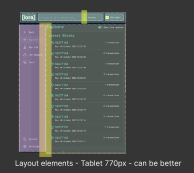  
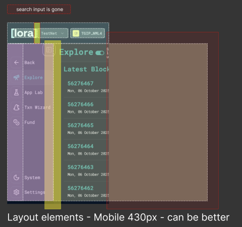

**Proposal:**  
Move the sidebar to a **collapsible drawer** triggered by a hamburger menu.  
Relocate the search, theme selector, and settings inside this drawer for mobile use.

**Proposal:**  
Keep the sidebar visible only on desktop.  
Use a **minimal header** with compact logo, screen title, and essential icons for mobile.

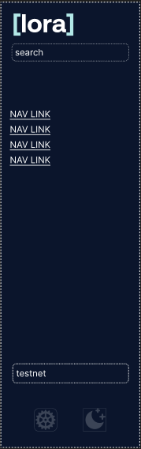  
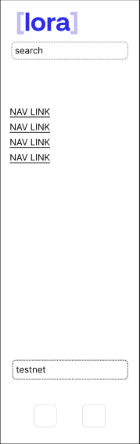

### Applied Example

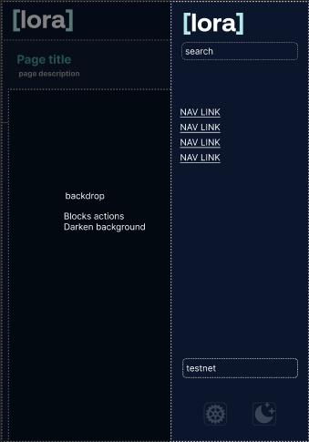

https://www.figma.com/design/HRHVr8iBuuIDhLgX2xcCxT/Lora-responsiveness-audit?node-id=0-1&t=oJMQrIBab6WO18zt-1

---

### 4. Unresponsive Tables

Data tables overflow horizontally without scroll cues.

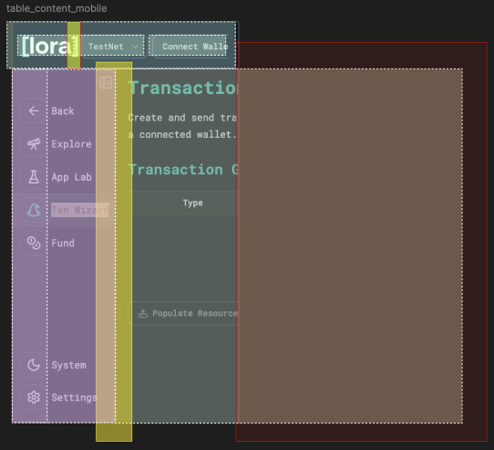

**Proposal:**  
Enable horizontal scrolling with clear indicators.  
For mobile, use **stacked card layouts** when appropriate.

---

### 5. “Latest Block” and “Latest Transaction” Cards

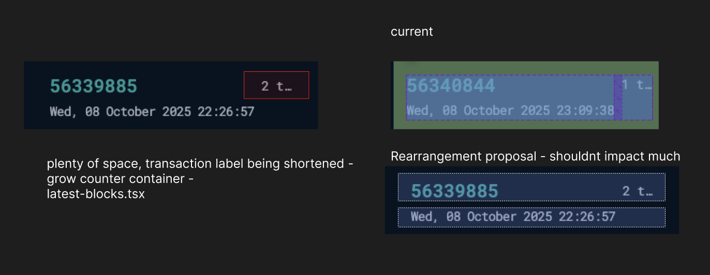

**Proposal:**  
Switch to a vertical (two-row) layout on smaller screens.  
This issue will largely be **resolved by hiding the sidebar** on mobile.

  
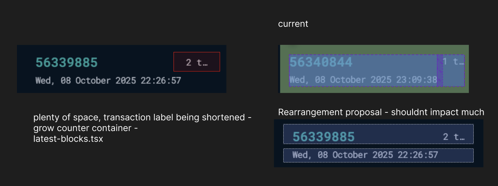

---

### 6. Grid and Description Lists

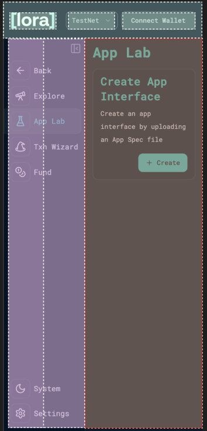  
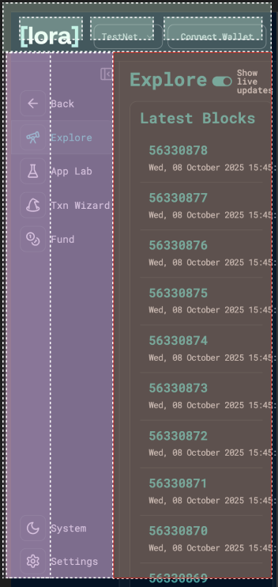  
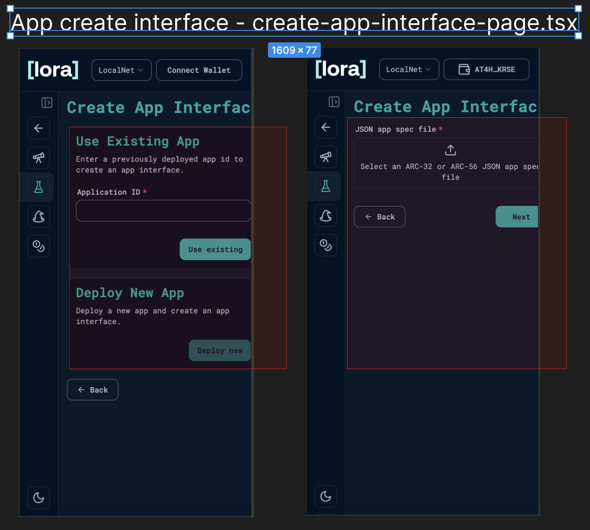

Multi-column grids and two-column lists are responsive but become cramped on small screens.  
**Proposal:**  
These layouts will naturally improve once the sidebar is collapsed.

---

### 7. Touch Targets and Typography

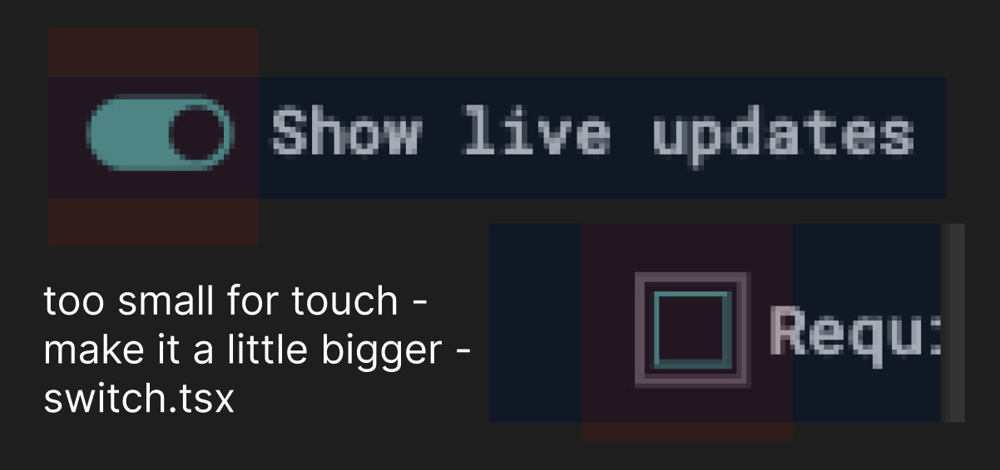

Buttons and form inputs may be too small for touch interactions.

**Typography:** Already suitable for mobile devices — **no major changes needed.**  
Spacing adjustments and minor padding refinements are sufficient.

**Proposal:**  
Increase tap areas for buttons and interactive elements.  
Sidebar removal will provide enough space for these improvements.

---

### 8. Modals and Overlays

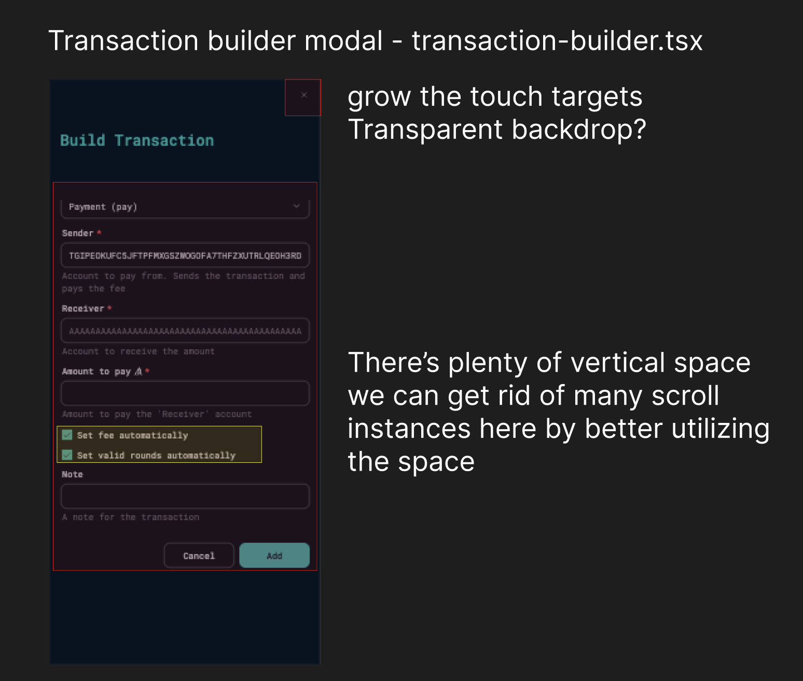

**Observation:** Some modals don’t scale well on smaller screens.  
**Proposal:** Convert modal windows into **full-width sheets** on mobile for smoother UX.

---

### 9. Table Column Visibility

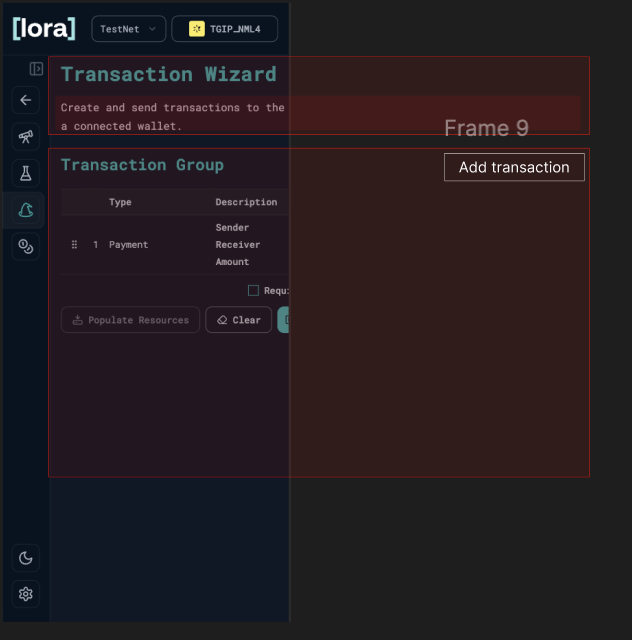

All columns render by default, overwhelming small screens.

**Proposal:**  
Enable horizontal scroll or hide non-essential columns for mobile layouts.

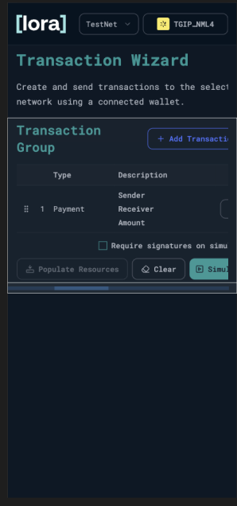

---

## 3. Layout Strategy (Mobile-First)

### Mobile and Tablet

- Replace persistent sidebar with a **collapsible drawer** accessed via hamburger menu.
- Move search, navigation links, theme selector, and settings into this drawer.
- Keep a minimal topbar with logo, title, and key action icons.
- Ensure scroll and layout transitions are smooth when opening/closing the drawer.

### Desktop

- Retain the sidebar and navigation as-is.
- Maintain central content alignment and consistent padding across breakpoints.

---

## 4. Component Summary

| Area               | Current Issue            | Recommended Fix               | Effort | Priority | Component                                  |
| ------------------ | ------------------------ | ----------------------------- | ------ | -------- | ------------------------------------------ |
| Topbar             | Overlapping elements     | Move search into drawer       | Medium | P0       | header.tsx                                 |
| Sidebar            | Visible on mobile        | Convert to collapsible drawer | Medium | P0       | left-side-bar-menu.tsx.                    |
| Tables             | Overflow on mobile       | Scrollable or stacked layout  | Medium | P0       | transactions-builder.tsx                   |
| Cards              | Two-column layout issues | Stack containers vertically   | Medium | P1       | latest-blocks.tsx, latest-transactions.tsx |
| Grids/Descriptions | Cramped layouts          | Collapse into single column   | Small  | P1       | create-app-interface-page.tsx              |
| Forms              | Small touch targets      | Increase touch targets size   | Small  | P1       | switch.tsx                                 |
| Modals/Overlays    | Not optimized for mobile | Better height usage           | Small  | P2       | transaction-builder.tsx                    |
| Typography         | Good as-is               | No changes needed             | None   | P3       |

---

## 5. Implementation Order

1. **Tailwind v4 Upgrade** — foundation for all responsive fixes.
2. **Layout Shell (P0):** Add collapsible drawer, hide sidebar on mobile.
3. **Search Relocation (P0):** Move into drawer, add header trigger.
4. **Tables (P0):** Add scroll or stacked layout for mobile.
5. **Cards, Grids, Descriptions (P1):** Adjust to one-column layouts.
6. **Forms & Touch Targets (P1):** Improve spacing and clickability.
7. **Overlays (P2):** Convert modals into adaptive sheets.
8. **Typography (P3):** Retain as-is; ensure scale consistency.

---

## 6. Tailwind v4 Migration

Upgrading from **v3.4.1 → v4.0** enables:

- Faster build times
- Accordance with latest CSS features
- CSS variable theming
- Container queries and color functions

### Migration Steps

1. **Upgrade Toolchain**
   ```bash
   npx @tailwindcss/upgrade@latest
   npm i -D @tailwindcss/cli @tailwindcss/postcss
   Config Review
   Migrate theme tokens to CSS variables.
   Plugin Check
   Validate shadcn/ui and other plugin compatibility.
   Testing
   Regression test across sm, md, and lg breakpoints.
   ```
2. Acceptance Criteria
   Tailwind v4 migration completed and stable.
   Collapsible sidebar fully functional below lg.
   No layout overflow or hidden content on mobile.
   Tables, cards, and modals adapt properly.
   Typography and spacing scale correctly.
   QA validated across iOS, Android, and desktop devices.
3. Next Steps
   Approve the drawer-first layout strategy.
   Execute Tailwind v4 migration.
   Implement the new header + drawer navigation.
   Refactor search and related UI elements.
   Conduct mobile QA testing and document final screenshots.
   ✅ Summary Note:
   Most responsiveness challenges will be resolved or smoothed out once the sidebar becomes collapsible.
   Typography already performs well across mobile and tablet screens — the focus should remain on layout restructuring, spacing, and touch optimization.
