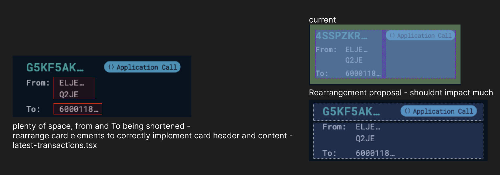

# AlgoKit Lora — Mobile Responsiveness Audit (v0.2)

## 1. Scope and Goals

### Scope

- Layout shell (header, topbar, sidebar, main content, footer)
- Navigation (primary, secondary, search)
- Data display (tables, grids, description lists)
- Forms and inputs
- Overlays (modals, popovers, drawers, dropdowns)
- Typography, spacing, touch targets, and interaction feedback
- Tailwind v4 readiness and migration implications

### Goals

- Ensure the application is fully usable and visually consistent across all devices.
- Eliminate layout overflow and cramped elements on mobile.
- Adopt a mobile-first structure using Tailwind v4’s improved utilities and container queries.
- Simplify and unify spacing and typography across breakpoints.

### Recommended Breakpoints

- **Mobile:** <640px
- **Tablet:** 640–1024px
- **Desktop:** >1024px
- **XL Desktop:** >1280px (optional)

---

## 2. Key Findings

### 1. Header/Topbar Cramping

On smaller screens, elements like the logo, search bar, network selector, and wallet button overlap or overflow.

### 2. Sidebar Space Usage

The sidebar remains visible on mobile, consuming excessive space and pushing content.

### 3. Hidden Search on Mobile

The search bar disappears completely on small viewports.

 

**Recommendation:**  
Move the sidebar to a **collapsible drawer** triggered by a hamburger menu. Relocate the search, theme selector, and settings inside this drawer for mobile use.

**Recommendation:**  
Keep the sidebar visible only on desktop.  
Use a minimal header with compact logo, screen title, and essential icons.

### Applied Example

---

### 4. Unresponsive Tables

Data tables overflow horizontally without scroll cues.

**Recommendation:**  
Enable horizontal scrolling with clear visual indicators. For mobile, use stacked card layouts when necessary.

---

### 5. Unresponsive “Latest Block” and “Latest Transaction” Cards

**Recommendation:**  
Switch to a vertical (two-row) layout on smaller screens.  
This issue is largely resolved by hiding the sidebar on mobile.

---

### 6. Grid and Description Lists

  

Multi-column grids and two-column lists become cramped on small screens.  
**Recommendation:** Collapse into a single-column layout and allow more vertical spacing.  
Hiding the sidebar improves this naturally.

---

### 7. Touch Targets and Typography

Buttons and form inputs may be too small for mobile touch interactions.  
Headings and text spacing are also optimized for desktop and feel oversized on mobile.

**Recommendation:**  
Increase tap area, and reduce heading sizes with better line height.  
Sidebar removal provides enough room for these fixes.

---

### 8. Modals and Overlays

Modals could better adapt to mobile screens.  
**Recommendation:** Convert to full-width sheets on smaller devices.

---

### 9. Table Column Visibility

All table columns render by default, overwhelming small screens.

**Recommendation:**  
Allow horizontal scroll or hide non-essential columns on mobile.

---

## 3. Layout Strategy (Mobile-First)

### Mobile and Tablet

- Replace persistent sidebar with a **collapsible drawer** accessed via hamburger menu.
- Move search, navigation links, theme selector, and settings into this drawer.
- Keep a minimal topbar with logo, title, and key action icons.

### Desktop

- Retain sidebar and main navigation as-is.
- Maintain central content alignment and consistent padding.

---

## 4. Component Summary

| Area               | Current Issue            | Recommended Fix               | Effort | Priority |
| ------------------ | ------------------------ | ----------------------------- | ------ | -------- |
| Topbar             | Overlapping elements     | Move search into drawer       | Medium | P0       |
| Sidebar            | Visible on mobile        | Convert to collapsible drawer | Small  | P0       |
| Tables             | Overflow on mobile       | Scrollable or stacked layout  | Large  | P0       |
| Cards              | Two-column layout issues | Stack vertically              | Small  | P1       |
| Grids/Descriptions | Cramped layouts          | Collapse into single column   | Small  | P1       |
| Forms              | Small touch targets      | Increase spacing              | Medium | P1       |
| Typography         | Oversized on mobile      | Adjust scales and line height | Small  | P2       |
| Modals/Overlays    | Not optimized for mobile | Convert to full-width sheets  | Medium | P2       |

---

## 5. Implementation Order

1. **Tailwind v4 Upgrade** — foundation for all responsive fixes.
2. **Layout Shell (P0):** Add collapsible drawer, hide sidebar on mobile.
3. **Search Relocation (P0):** Move into drawer, add header trigger.
4. **Tables (P0):** Add scroll or stacked layout for mobile.
5. **Cards, Grids, Descriptions (P1):** Adjust to one-column layouts.
6. **Forms & Typography (P1/P2):** Improve spacing and readability.
7. **Overlays (P2):** Convert modals into adaptive sheets.

---

## 6. Tailwind v4 Migration

Upgrading from **v3.4.1 → v4.0** enables:

- Faster build times.
- Automatic content detection.
- CSS variable theming.
- Container queries and color functions.

### Migration Steps

1. **Upgrade and Toolchain**
   - `npx @tailwindcss/upgrade@latest`
   - `npm i -D @tailwindcss/cli @tailwindcss/postcss`
2. **Config Review**
   - Migrate theme tokens to CSS variables.
3. **Plugin Check**
   - Validate shadcn/ui and any other plugin compatibility.
4. **Testing**
   - Perform regression testing across sm, md, lg viewports.

---

## 7. Acceptance Criteria

- Tailwind v4 successfully migrated and stable.
- Collapsible sidebar fully functional on <lg.
- No layout overflow or hidden content on mobile.
- Tables, cards, and modals adapt correctly.
- Typography and spacing scale cleanly across all breakpoints.
- QA validated on iOS, Android, and desktop.

---

## 8. Next Steps

1. Approve the **drawer-first layout strategy**.
2. Execute Tailwind v4 migration.
3. Implement the new header + drawer navigation.
4. Refactor search and key layouts.
5. Test responsiveness across devices and document results.
